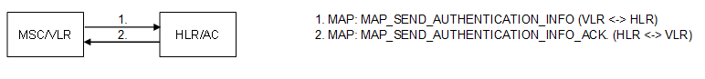

| **Key Configurations** | **Required Network Elements** |
|----|----|
| Authentication vectors in AuC, IMSI/Ki provisioned, RAND/SRES exchange enabled | MS, MSC/VLR, HLR, AuC |

- **AuC:** The Authentication Center (AuC) is co-located with or
  securely linked to the HLR. It is the repository for the subscriber's
  secret authentication key (Ki) and the algorithm for generating
  authentication triplets (RAND, SRES, Kc).

- **VLR:** The VLR is configured to request authentication triplets from
  the HLR/AuC and perform the authentication challenge with the mobile
  station.
