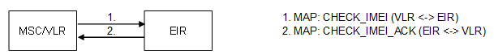

| **Key Configurations** | **Required Network Elements** |
|----|----|
| IMEI database in EIR configured, MSC query to EIR enabled | MS, MSC/VLR, EIR |

- **MSC:** The MSC must have a signaling route to the Equipment Identity
  Register (EIR).

- **EIR:** The EIR database must contain the white list, black list, and
  grey list of IMEIs. The MSC sends a query to the EIR to check the
  status of the mobile device's IMEI.
