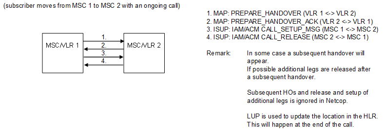

| **Key Configurations** | **Required Network Elements** |
|----|----|
| Inter-MSC trunks configured, MAP/ISUP for HO signaling | MS, Source MSC, Target MSC, BTS/BSC, RNC |

- **MSC:** Both the Source and Target MSCs must have a defined
  signalling route (ISUP/SS7) between them. The MSCs must also be
  configured to accept and process Handover Required and Handover
  Request messages.

- **BSC/RNC:** The BSC/RNCs must be configured with a list of
  neighbouring cells and the MSCs that serve them.
