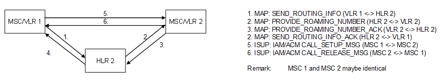

| **Key Configurations** | **Required Network Elements** |
|----|----|
| Both subscribers active in HLR/VLR, MSC-MSC routing/trunks configured | Calling MS, Called MS, MSCs, HLR, VLR |

**Definitions:** This is a combination of MO and MT definitions. Both
the originating and terminating subscribers must have their respective
profiles and location data defined in the network.
