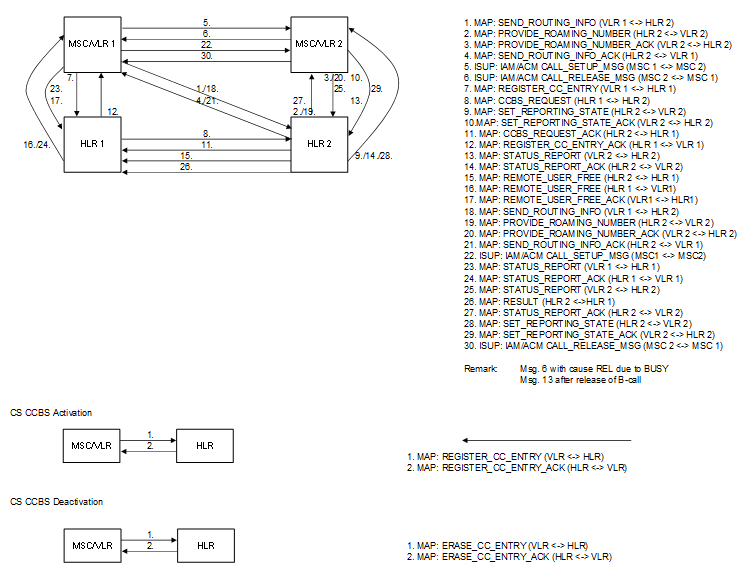

| **Key Configurations** | **Required Network Elements** |
|----|----|
| CCBS service active in HLR, MSC supports CCBS signaling | Calling MS, Called MS, MSC/VLR, HLR |

- **HLR/HSS:** Both the originating and terminating subscribers must
  have the CCBS supplementary service provisioned in their HLR profiles.

- **MSC:** The MSCs must be configured to support the CCBS signaling
  procedures, including setting timers to monitor when a busy subscriber
  becomes idle and initiating the recall procedure.
