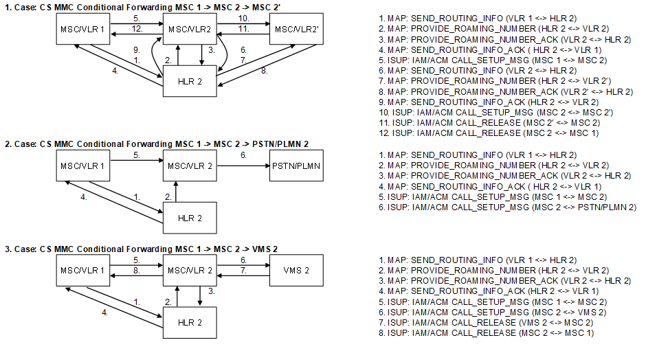

| **Key Configurations** | **Required Network Elements** |
|----|----|
| Forwarding active for called MS, MSC routes to forwarding number | Calling MS, Called MS, MSCs, HLR |

**Definitions:** Similar to the previous item, the called subscriber's
HLR profile must define the conditional forwarding criteria. The MSC
handling the terminating leg must recognize the busy or no-reply
condition and initiate the forwarding procedure.
