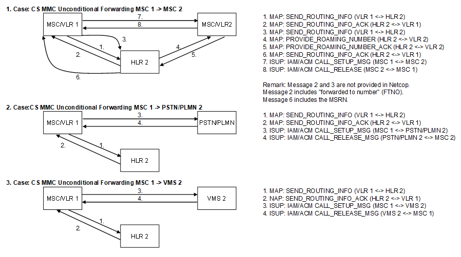

1.  

| **Key Configurations** | **Required Network Elements** |
|----|----|
| CFU active, called subscriber always forwarded to defined number | Calling MS, Called MS, MSCs, HLR |

**Definitions:** The HLR profile of the called subscriber must be
defined with unconditional forwarding. The originating MSC's query to
the HLR for the called party's location will be redirected to the
forwarded number.
