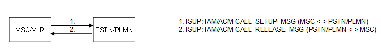

| **Key Configurations** | **Required Network Elements** |
|----|----|
| Subscriber provisioned in HLR, MO call service active, MSC routing configured | MS, BTS/BSC/NodeB/RNC, MSC/VLR, HLR |

- **HLR/HSS:** A subscriber profile must be defined, including the
  International Mobile Subscriber Identity (IMSI) and the Mobile Station
  International Subscriber Directory Number (MSISDN).

- **VLR:** The VLR must have a record of the subscriber's location,
  including the Location Area Identity (LAI) and a temporary subscriber
  identifier (TMSI).

- **MSC:** Must be configured with routing tables and digit analysis to
  interpret the dialed number and route the call to its destination.

- **BSC/RNC:** Must be configured with radio channel definitions,
  including frequencies and timeslots, for the serving cells.
