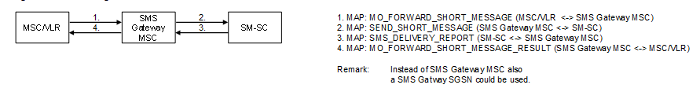

| **Key Configurations** | **Required Network Elements** |
|----|----|
| SMSC routing configured in MSC, MO-SMS subscription active in HLR | MS, MSC/VLR, SMSC, HLR |

- **VLR/MSC:** Must have a signaling route to the SMSC.

- **HLR/HSS:** The subscriber's profile must include the address of
  their home SMSC.

- **SMSC:** The SMSC must be configured to receive and store messages
  and forward them to their destination.
