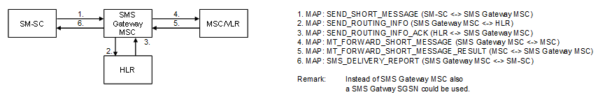

| **Key Configurations** | **Required Network Elements** |
|----|----|
| MT-SMS subscription active, SMSC delivery to MSC configured | MS, SMSC, MSC/VLR, HLR |

- **SMSC:** The SMSC must be configured with a signaling route to the
  HLR to query the subscriber's serving VLR.

- **HLR/HSS:** Must be able to provide the serving VLR address to the
  SMSC in response to a Send Routing Info for SM (SRI-SM) query.
