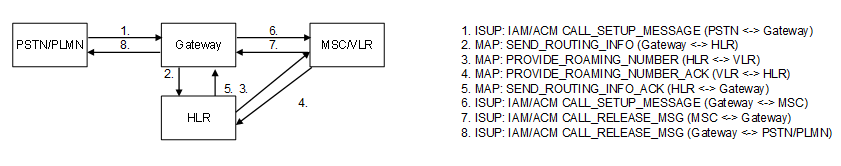

| **Key Configurations** | **Required Network Elements** |
|----|----|
| MT call service active, GMSC routing to MSC, subscriber reachable in VLR | MS, BTS/BSC/NodeB/RNC, GMSC, MSC/VLR, HLR |

- **HLR/HSS:** The HLR must contain the subscriber's profile and be
  addressable by the Gateway MSC (GMSC) to provide routing information.
  It must be able to provide the address of the serving VLR.

- **GMSC:** Must be configured to query the HLR for the called
  subscriber's routing information.

- **VLR:** Must have a valid location record for the subscriber.

- **MSC:** Must be configured to receive the call from the GMSC and
  initiate the paging process to locate the mobile station.
