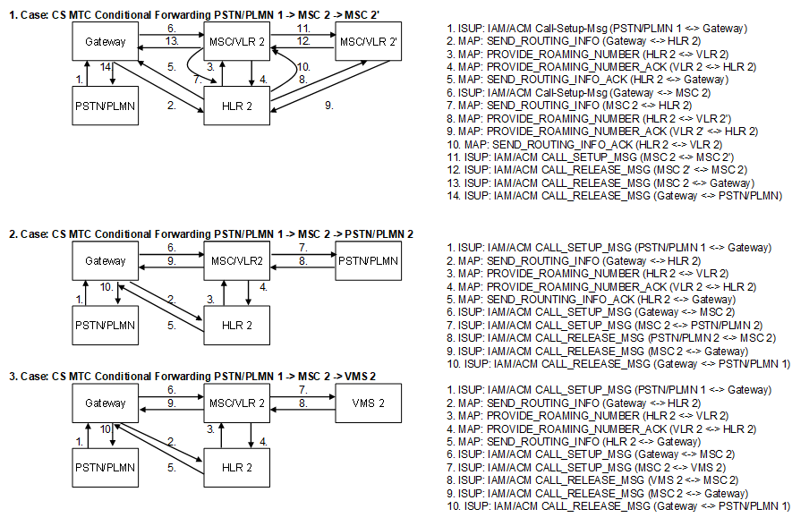

| **Key Configurations** | **Required Network Elements** |
|----|----|
| Conditional forwarding (CFB/CFNRy) provisioned in HLR with valid target number | MS, MSC/VLR, HLR, Forwarding Number |

**HLR/HSS:** The subscriber's HLR profile must have the conditional
forwarding flag enabled and the forwarded-to number stored. The profile
must also specify the conditions for forwarding, such as "Forward on
Busy," "Forward on No Reply," or "Forward on Not Reachable."
