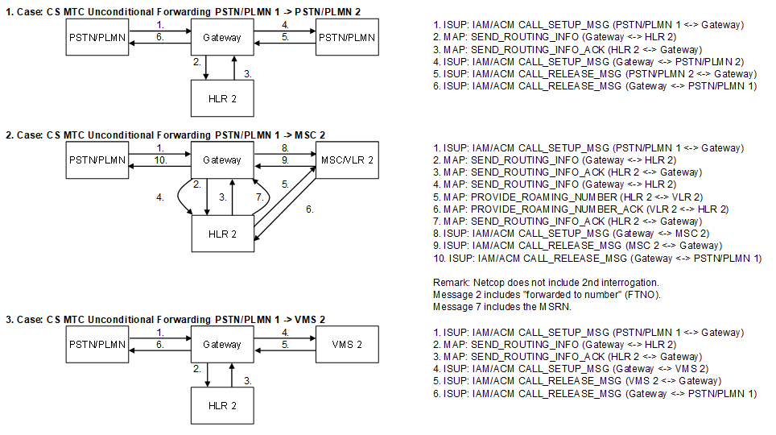

| **Key Configurations** | **Required Network Elements** |
|----|----|
| CFU provisioned in HLR, MSC routes directly to forwarding number | MS, MSC/VLR, HLR, Forwarding Number |

**HLR/HSS:** The subscriber's HLR profile must be defined with the
"unconditional forwarding" flag and the number to which all calls should
be forwarded. This setting bypasses the standard location query to the
VLR.
