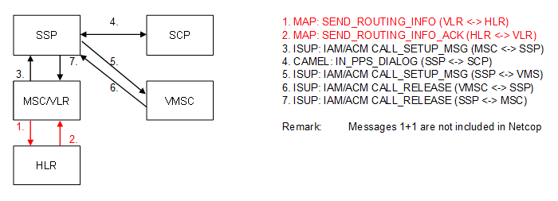

| **Key Configurations** | **Required Network Elements** |
|----|----|
| Prepaid profile provisioned, CAMEL routing to VMS | MS, MSC/VLR, SCP/IN, VMS |

**Definitions:** Similar to prepaid calls, the VMS short Code in the MSC
must be configured with an IN trigger to query the SCP for the
subscriber's balance before allowing access to the voicemail service.
