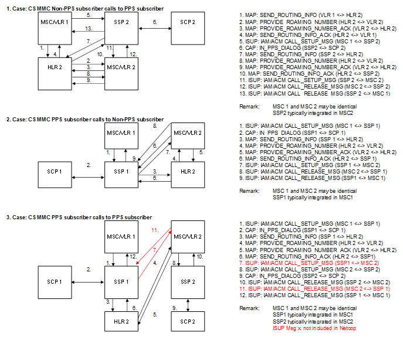

| **Key Configurations** | **Required Network Elements** |
|----|----|
| Both subs prepaid-enabled, CAMEL triggers in HLR, MSC-IN connectivity | Calling MS, Called MS, MSCs, HLR, SCP/IN |

**Definitions:** This scenario combines the definitions of prepaid MO
and MT calls for both the originating and terminating legs of the call,
as applicable.
