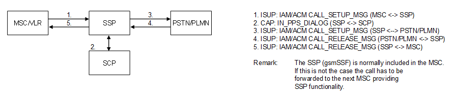

| **Key Configurations** | **Required Network Elements** |
|----|----|
| CAMEL trigger in HLR, prepaid profile in SCP, CAP signaling enabled | MS, MSC/VLR, HLR, SCP/IN |

- **HLR/HSS:** The subscriber's profile must be flagged to indicate that
  they are a prepaid subscriber. This flag triggers a routing
  instruction to the Intelligent Network (IN) platform.

- **MSC/SSP:** The Mobile Switching Center (MSC) must be provisioned as
  a Service Switching Point (SSP) and configured with an Initial
  Detection Point (IDP) trigger for prepaid subscribers.

- **SCP:** The Service Control Point (SCP) must be provisioned with the
  subscriber's account balance, tariff plan, and the logic to approve
  the call and a granted duration.
