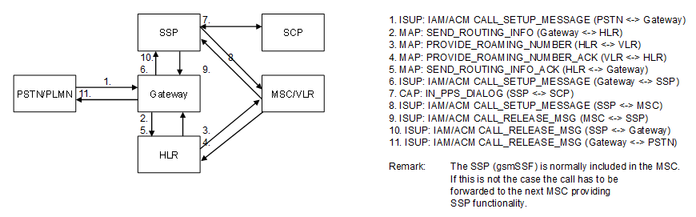

| **Key Configurations** | **Required Network Elements** |
|----|----|
| CAMEL trigger in HLR, prepaid SCP routing for incoming calls | MS, GMSC, MSC/VLR, HLR, SCP/IN |

**Definitions:** For a terminating call to have prepaid logic (e.g., for
certain forwarded calls or premium services), the HLR profile and the
MSC/SSP must have specific triggers defined for Mobile Terminating calls
to initiate an IN query to the SCP.
