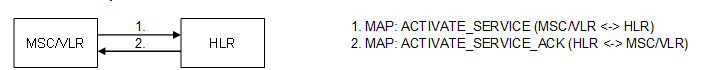

| **Key Configurations** | **Required Network Elements** |
|----|----|
| USSD service provisioned in HLR, USSD gateway or IN node configured | MS, MSC/VLR, HLR, SCP/IN |

**MSC:** The MSC's digit analysis must be configured to recognize
specific USSD codes (e.g., \*#100#) and route them to the relevant
application server or gateway.
