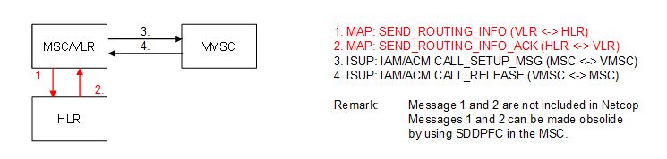

| **Key Configurations** | **Required Network Elements** |
|----|----|
| VMS number provisioned in HLR, MSC routes to VMS system | MS, MSC/VLR, HLR, Voice Mail System (VMS) |

- **MSC:** The MSC's digit analysis and routing tables must have a
  specific entry that routes calls to the Voice Mail System (VMS)
  platform based on the dialled VMS retrieval short Code (e.g., \*123).

- **VMS:** The VMS platform must be configured to receive calls and
  authenticate the subscriber based on their CLI (Calling Line
  Identity).
